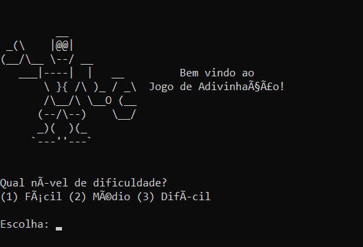
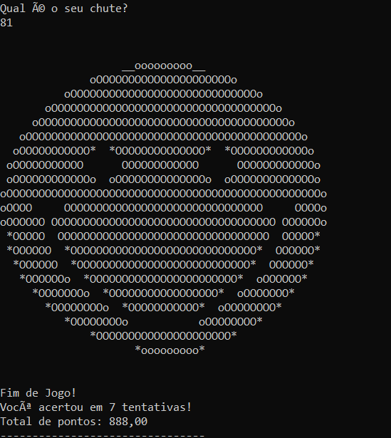
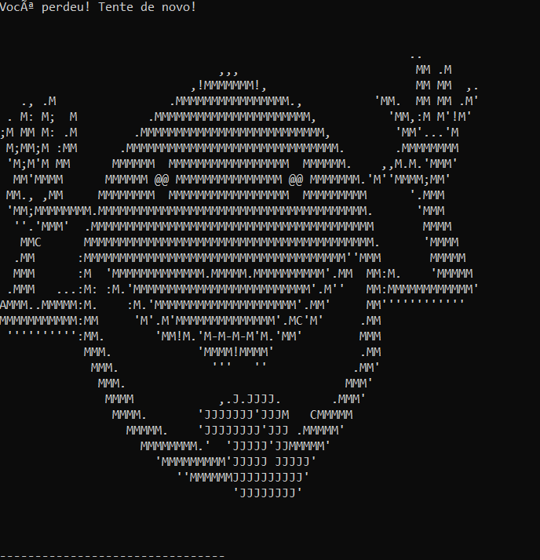

# Jogo de Adivinhação de Números (Linguagem C)

Este é um jogo interativo para terminal desenvolvido em C, onde o usuário tenta adivinhar um número secreto gerado aleatoriamente pelo computador. O projeto conta com diferentes níveis de dificuldade, sistema de pontuação baseado na precisão dos palpites e artes visuais em ASCII.

## 🛠️ Tecnologias e Conceitos Utilizados
* **Linguagem:** C
* **Bibliotecas Clássicas:** `<stdio.h>`, `<stdlib.h>`, `<time.h>` e `<locale.h>`.
* **Estruturas de Controle:** Loops (`for`), condicionais (`if/else`) e controle de fluxo (`switch/case`).

## 🕹️ Como Funciona o Jogo?
1. O jogador escolhe um nível de dificuldade: Easy (20), Médio (15) ou Difícil (6 tentativas).
2. A cada erro, o sistema diz se o número secreto é maior ou menor.

## 🖥️ Demonstração do Sistema

### Menu Inicial

### Tela de Vitória

### Tela de Game Over

